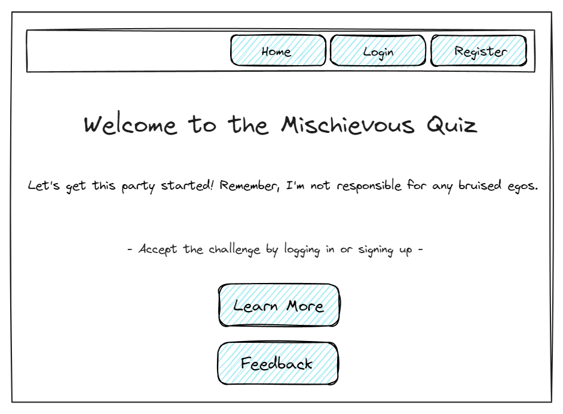

# "Mischevious Quiz" Game

"Mischievous Quiz" is an engaging and interactive quiz game where simplicity meets deception. Each question, while seemingly straightforward, is a clever trick or a witty riddle designed to challenge the player. The real charm of the game comes from its charismatic quizmaster, a character who delights in cheekily commenting on players' responses—celebrating their successes with humor and poking fun at their missteps. This game is not just about right answers; it's a playful battle of wits where the quizmaster brings an element of surprise and amusement to every question. 

Perfect for:
-   **Curious Minds:** Ideal for those who love to probe and ponder, perfect for players who enjoy puzzles and mind games.
-   **Social Players:** A great choice for game nights, offering a mix of humor and challenge that sparks conversation and laughter.
-   **Learners of All Ages:** From young learners to the young at heart, suitable for anyone who likes learning through play and enjoys being challenged in unexpected ways.

Many quiz games either lack interactivity or are not challenging enough, leading to quick disinterest. Mischievous Quiz aims to keep players on their toes with hilariously misleading questions and a taunting quizmaster.

## Core Functionality

- **Dialogue Dynamics with Mischief, the Quizmaster:** Mischief enhances the gameplay with his unique reactions to players' answers, enriching the interactive experience with lively comments that vary based on player performance.
- **Quiz Interactions:** Players can start new quizzes, answer questions, and proceed through a series of increasingly tricky queries.
- **Score Tracking:**  Players' scores are recorded throughout their session, allowing them to see their current standing and review past performance in future sessions.
- **User Accounts:** Enable users to register and log in, maintaining a record of their scores and progress over time for a personalized gaming experience.
- **Feedback Mechanism:** Players have the ability to leave comments on their quiz experience, influencing future game improvements and adjustments.

## Requirements
### User Stories

#### Quiz Partcipation

- **As a player, I want to start a quiz** so that I can test my knowledge with challenging questions.
- **As a player, I want to receive immediate feedback on my answers** to learn whether I got them right or wrong.
- **As a player, I want to see my current score during the quiz** to track my progress in real-time.
- **As a player, I want to see my highest score at the end of the quiz**  to see if I have beaten my previous records.
- **As a player, I want to mute and unmute game music** to customize my quiz experience according to my preference.

#### Account Management

- **As a user, I want to register for an account** to maintain a record of my scores and participate in the game.
- **As a user, I want to log in** to access my high scores and participate under my username.
- **As a user, I want to log out** to ensure my account is secure when I'm not using it.

#### Feedback and Interaction

- **As a player, I want to submit feedback on my quiz experience** to help improve the game and express my opinions.
- **As a player, I want to edit and delete my own feedback** to refine my contributions or remove them if I change my mind.
- **As a player, I want to view feedback left by others** to see what other players think about the game.

#### System Functionality

- **As the system, I need to authenticate users** to ensure that only registered players can create, edit, and delete feedback, and access personalized features like score tracking and music preferences.
- **As a system, I need to accurately calculate and display scores to provide immediate feedback to users.**
- **As the system, I need to implement security measures to protect user data** from unauthorized access and ensure compliance with data protection regulations.
- **As the system, I need to manage session states efficiently** so that users can experience a seamless flow through the quiz without data loss or duplication.

## ᛦ Entity Relationships

## 📍 API Routes
### User Authentication

| Request        | Action                               | Response             | Description                                    |
| -------------- | ------------------------------------ | -------------------- | ---------------------------------------------- |
| GET /login     | AuthController::getLoginForm         | 200 /login-view      | Display the login form.                        |
| POST /login    | AuthController::login                | 302 Redirect /home2-view // 401 or 400  | Process login and redirect to home if successful. |
| GET /register  | AuthController::getRegistrationForm  | 200 /register-view   | Display the registration form.                 |
| POST /register | AuthController::register             | 302 Redirect /login-view // 400 | Process registration and redirect to login.    |
| GET /logout    | AuthController::logout               | 302 Redirect /home-view // 401  | Logout user and redirect to home page.         |

### Quiz Management

| Request           | Action                         | Response              | Description                                                           |
| ----------------- | ------------------------------ | --------------------- | --------------------------------------------------------------------- |
| GET /quiz/start   | QuizController::startQuiz      | 200 /questions-view // 401   | Start the quiz and show the first question.                           |
| POST /quiz/answer | QuizController::submitAnswer   | 200 /questions-view // 404 if quiz session ended  | Submit an answer, provide immediate feedback, then load the next question.   |
| GET /quiz/next    | QuizController::nextQuestion   | 200 /questions-view // 404  | Load the next question within the questions view.                     |
| GET /quiz/end     | QuizController::endQuiz        | 200 /end-view // 401, 403        | Display the end of quiz results with options to play again or return. |

### Feedback Mechanism

| Request                 | Action                               | Response               | Description                                                      |
| ----------------------- | ------------------------------------ | ---------------------- | ---------------------------------------------------------------- |
| GET /feedback           | FeedbackController::viewFeedback     | 200 /feedback-view     | Display feedback page, different permissions for logged in/out.  |
| POST /feedback          | FeedbackController::createFeedback   | 201 /feedback-view // 401 if not logged in    | Allow logged in users to create feedback.                        |
| PUT /feedback/:id       | FeedbackController::updateFeedback   | 200 /feedback-view // 401, 403   | Allow users to update their own feedback.                        |
| DELETE /feedback/:id    | FeedbackController::deleteFeedback   | 200 /feedback-view // 401, 403 if user does not own feedback   | Allow users to delete their own feedback.                        |

## 📐 Wireframes

>[!note] > These wireframes provide a basic visual guideline for the app's design. They're simple but help visualize the flow and interaction of the game.

The home view for logged-out users serves as the welcome page. It offers a quick introduction to the game, showcasing the playful nature of the quiz and its host, Mischief the Quizmaster. Users have the options to log in or register to play, alongside a 'Learn More' button that provides further details about the game mechanics and Mischief's role. Logged-out users can view feedback from other players through a 'Feedback' link but cannot interact or leave comments themselves.

Once logged in, the home view transforms to welcome the player by name, inviting them directly to engage with the quiz. This view offers access to start a new quiz session with buttons for 'Start', 'Learn More' about the game, and to actively participate in the 'Feedback' section. Feedback becomes interactive for logged-in users, allowing them to post, edit, and delete their comments based on their game experience. This interactive feedback mechanism is designed to foster community interaction and influence game improvements.

The register view allows new players to join the Mischievous Quiz by filling out a form with their email, username, password, and password confirmation. A 'Register' button completes the sign-up process.

The login view is designed for returning users to quickly access their accounts. It includes fields for email and password, as well as a 'Remember Me' checkbox for convenience. The form culminates with a 'Login' button, and there's a link to the registration page for newcomers.

This view displays the current question number and the user's score at the top. The main area presents the quiz question and multiple-choice answers. Each question is accompanied by Mischief, the quizmaster, who dynamically changes expressions and provides engaging dialogue based on the user's responses. This interactive element adds a unique and lively aspect to the quiz, enhancing the gaming experience. The user's current score is also displayed, updating with each answered question.

After completing the quiz, the end view congratulates the player and displays their final score along with their highest score to date. Options to 'Play Again' or 'Return' to the main menu allow players to either restart the quiz or exit to the Homescreen.